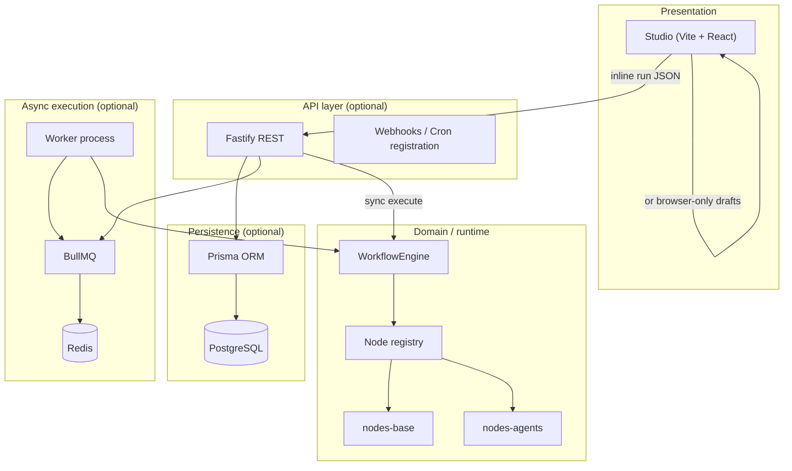
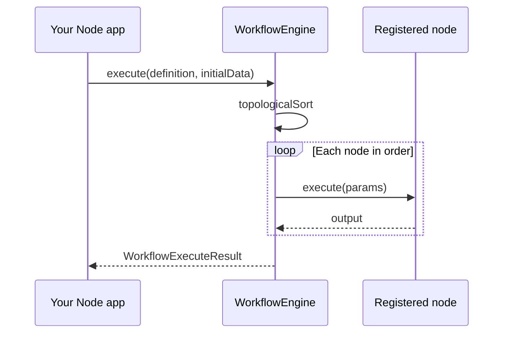
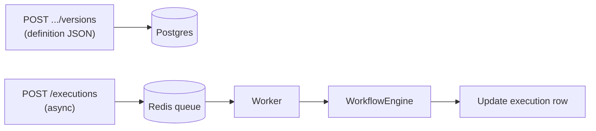
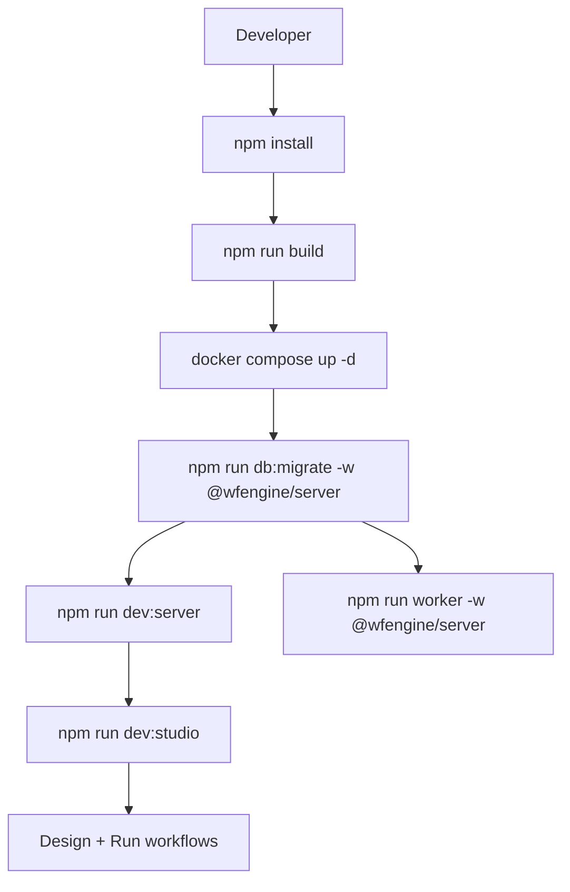

# Architecture and business logic

## Business concept

**wfengine** runs **workflows** defined as a **DAG** (directed acyclic graph): **nodes** are steps, **edges** pass data in execution order. Triggers and actions are the same graph; “when to run” is either your own `engine.execute` call, the **REST API**, a **webhook**, or a **cron** job that enqueues work.

**Business rules (engine):**

1. **Topological order** — a node runs only after all upstream nodes in the graph have finished.
2. **Input merge** — each node receives **inputData**: shallow merge of upstream **object** outputs plus **initialData** for entry nodes.
3. **Config vs data** — `node.config` is static for that version; **inputData** is the live payload along edges.
4. **Agent-invoke-only nodes** — if `config.wfengineToolOnly` is true, the node is **not** executed as a normal scheduled step; it is expected to run when an **LLM** calls it via `workflow_node` tools (or the run fails with an explicit error if never invoked).
5. **Retries and errors** — optional retry policy; `onNodeError: "stop" | "continue"` controls whether later nodes run after a failure.

## Layered architecture

## Execution paths

### Path A — Embedded (no server)

### Path B — Studio inline run

Studio sends the current graph + initial payload to **`POST /runs/inline`** (or equivalent route); the server loads the same **WorkflowEngine** and node registry, then returns **per-node outputs** and errors.

### Path C — Stored version + queue

## Multi-agent and tools (business logic)

- **Shared tools** on `autogen.multi-agent` reference **`workflow_node`** entries (by canvas **node id**).
- During an agent turn, **OpenAI-compatible** tool calls can invoke **`agentToolDispatch.executeWorkflowNode`**, which runs the target node with merged **inputData** and records output for downstream tool calls (e.g. write file → email).

Binding modes (e.g. **pipeline last turn tools required**) exist so the model must emit **tool_calls** on the executor turn—reducing “text-only” replies when file/email steps are required.

## Key files (logic)

| Concern | Location |
|---------|----------|
| DAG walk, tool-only handling | `packages/core/src/engine.ts` |
| Tool dispatch, ancestor checks | `packages/core/src/agent-tool-dispatch.ts` |
| Topological sort, downstream helpers | `packages/shared/src/workflow-dag.ts` |
| Multi-agent orchestration | `packages/nodes-agents/src/runtime/autogen-orchestrator.ts` |
| HTTP routes, enqueue | `apps/server/src/` |

## Process diagram — full local dev with API

This diagram is **operational**; the structural layer diagram earlier describes **components**.
