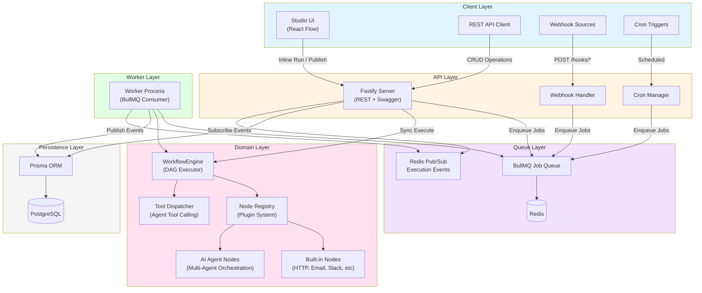
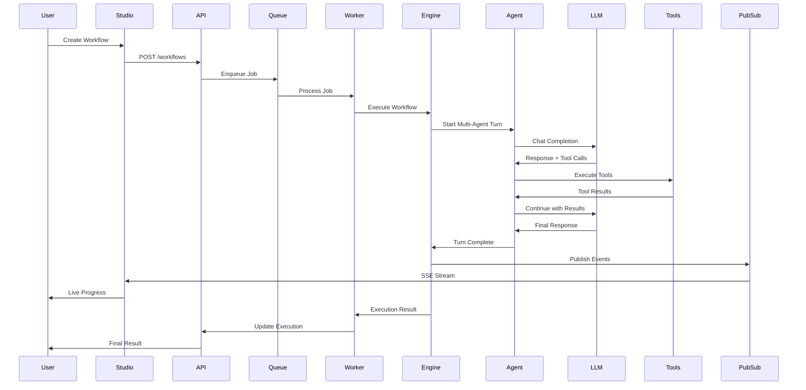
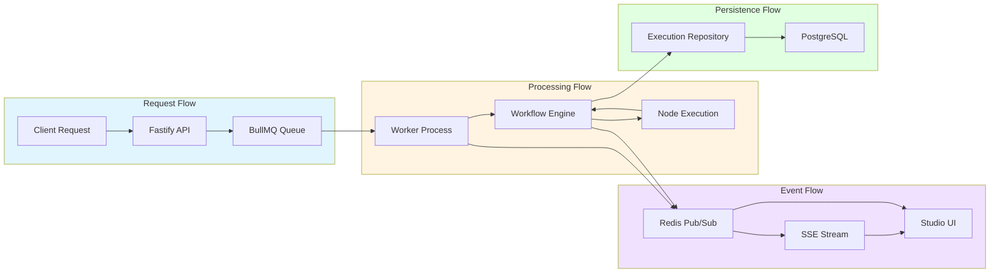
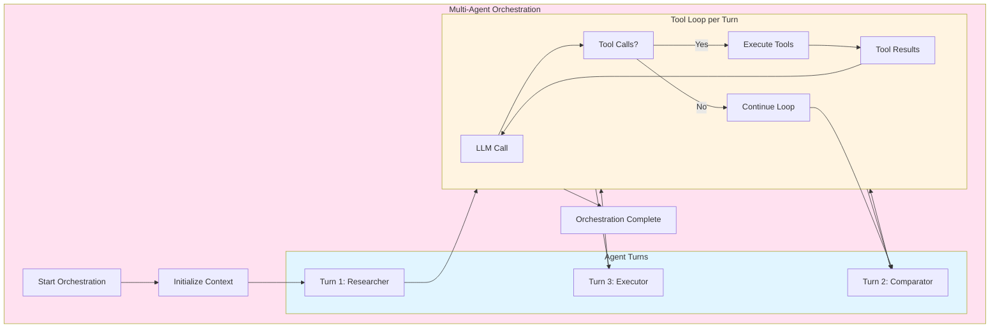
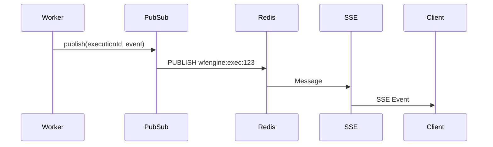
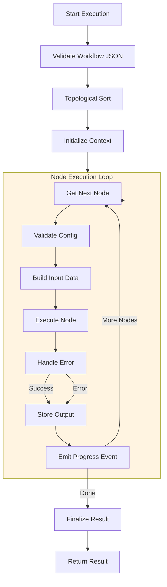
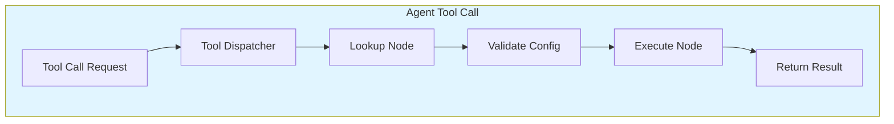

# Workflow Engine SDK - Complete Architecture Documentation

## Table of Contents
1. [Quick Start](#quick-start)
2. [System Overview](#system-overview)
3. [Architecture Diagrams](#architecture-diagrams)
4. [Multi-Agent System](#multi-agent-system)
5. [Async Execution & Pub/Sub](#async-execution--pubsub)
6. [Workflow Execution Flow](#workflow-execution-flow)
7. [Package Structure](#package-structure)
8. [Key Components](#key-components)
9. [Optimization Opportunities](#optimization-opportunities)

---

## Quick Start

### Prerequisites
- Node.js 18+
- PostgreSQL 14+
- Redis 6+

### Installation
```bash
npm install
```

### Local Development Setup
```bash
# Start infrastructure (PostgreSQL + Redis)
docker compose up -d

# Run database migrations
npm run db:migrate

# Start API server (port 3000)
npm run dev:server

# Start Studio UI (port 5173)
npm run dev:studio

# Start worker (for async execution)
npm run start:worker
```

### Production Deployment
```bash
# Build all packages
npm run build

# Start API server
npm run start:api

# Start worker
npm run start:worker

# Start combined mode (API + Worker in one process)
npm run start:combined
```

### URLs
- **Studio UI**: http://localhost:5173
- **API Server**: http://localhost:3000
- **API Documentation**: http://localhost:3000/api-docs
- **Health Check**: http://localhost:3000/health

---

## System Overview

The Workflow Engine SDK is a developer-first workflow automation platform that enables execution of JSON-based DAG (Directed Acyclic Graph) workflows with built-in multi-agent orchestration capabilities.

### Core Technologies
- **Runtime**: Node.js 18+ with TypeScript 5.7
- **Database**: PostgreSQL with Prisma ORM
- **Queue**: BullMQ with Redis for async job processing
- **Pub/Sub**: Redis pub/sub for real-time execution events
- **Frontend**: React 18 with React Flow for visual workflow design
- **Backend**: Fastify 5 for REST API

### Key Features
- **DAG Execution**: Topological sort-based node execution
- **Multi-Agent Orchestration**: Round-robin agent turns with tool calling
- **Async Execution**: BullMQ job queue with retry logic
- **Real-time Events**: Redis pub/sub for live execution progress
- **Tool Calling**: OpenAI-compatible tool calling for agents
- **State Machine**: Workflow state management with checkpoints
- **Idempotency**: Guaranteed idempotent operations

---

## Architecture Diagrams

### High-Level System Architecture



### Multi-Agent Orchestration Flow



### Async Execution Flow



---

## Multi-Agent System

### Architecture Overview

The multi-agent system implements a round-robin orchestration pattern inspired by AutoGen, but built entirely in TypeScript without Python dependencies.

### Key Components

#### 1. Agent Orchestration (`packages/nodes-agents/src/runtime/autogen-orchestrator.ts`)
- **Round-robin turns**: Agents take turns in a fixed order
- **Tool binding**: Configurable tool binding strategies
- **Validation gates**: Ensures executor has sufficient context
- **Abort support**: Respects AbortSignal for cancellation

#### 2. Tool Loop (`packages/nodes-agents/src/runtime/openai-tool-loop.ts`)
- **OpenAI-compatible**: Works with OpenAI, Ollama, and compatible providers
- **Tool calling**: Automatic tool selection and execution
- **Loop control**: Max iterations, timeout handling
- **Error recovery**: Retry logic for failed tool calls

#### 3. Tool Dispatch (`packages/core/src/agent-tool-dispatch.ts`)
- **Node execution**: Executes workflow nodes as tools
- **Context passing**: Passes upstream data to tools
- **Retry handling**: Respects node retry configuration
- **Signal propagation**: Supports cancellation

### Multi-Agent Flow Diagram



### Agent Configuration

```typescript
interface AgentPersona {
  name: string;
  systemPrompt: string;
  model?: string;
  temperature?: number;
}

interface MultiAgentConfig {
  agents: AgentPersona[];
  maxTurns: number;
  tools?: AgentToolRef[];
  multiAgentToolBinding?: "openai_tools_auto" | "pipeline_last_turn_tools_required";
  forceToolsFirstCompletionOnTurnIndices?: number[];
}
```

### Tool Binding Strategies

1. **openai_tools_auto**: OpenAI automatically decides when to use tools
2. **pipeline_last_turn_tools_required**: Only the last agent (executor) must use tools

---

## Async Execution & Pub/Sub

### BullMQ Job Queue

**Queue Configuration** (`apps/server/src/queue.ts`):
```typescript
export const QUEUE_NAME = "wfengine-jobs";

export interface ExecuteJobPayload {
  type: "execute";
  executionId: string;
}

export interface CronTickPayload {
  type: "cronTick";
  workflowVersionId: string;
}
```

**Job Options**:
- **Retry attempts**: 3
- **Backoff strategy**: Exponential (1000ms base)
- **Remove on complete**: Keep last 1000 jobs
- **Remove on fail**: Keep last 5000 jobs

### Redis Pub/Sub Event Bus

**Event Types** (`apps/server/src/execution-event-bus.ts`):
```typescript
export type ExecutionEventType =
  | "execution_queued"
  | "execution_started"
  | "execution_completed"
  | "execution_failed"
  | "node_started"
  | "node_completed"
  | "agent_turn_started"
  | "agent_turn_completed"
  | "tool_call_started"
  | "tool_call_completed"
  | "openai_call_started"
  | "openai_call_completed"
  | "log";
```

**Channel Format**: `wfengine:exec:{executionId}`

**Publisher**: Worker process publishes events as nodes execute
**Subscriber**: SSE route subscribes per-executionId and forwards to client

### Pub/Sub Flow Diagram



### Async vs Sync Execution

**Sync Execution** (`POST /executions` with `async: false`):
- Blocks until workflow completes
- Returns full execution result
- Use for fast workflows (< 30s)

**Async Execution** (`POST /executions` with `async: true`):
- Returns immediately with execution ID
- Worker processes job in background
- Poll `/executions/:id` for results
- Use for long-running workflows

---

## Workflow Execution Flow

### DAG Execution Algorithm



### Node Execution Details

**Input Data Building**:
1. Collect outputs from all parent nodes
2. Merge with initial data
3. Apply variable substitution
4. Pass to node executor

**Error Handling**:
- **onNodeError: "stop"**: Stop execution on first error
- **onNodeError: "continue"**: Continue execution, store error in output

**Retry Logic**:
- Configurable retry count per node
- Exponential backoff between retries
- Abort signal support for cancellation

### Tool Dispatch Flow



---

## Package Structure

```
workflow-engine-sdk/
├── apps/
│   ├── server/                    # Fastify REST API + Worker
│   │   ├── src/
│   │   │   ├── routes/          # API route handlers
│   │   │   ├── services/        # Business logic
│   │   │   ├── worker.ts        # BullMQ worker
│   │   │   ├── execution-event-bus.ts  # Redis pub/sub
│   │   │   ├── queue.ts         # BullMQ queue config
│   │   │   └── main.ts          # Fastify server
│   │   └── prisma/              # Database schema
│   │
│   └── studio/                   # React Flow visual editor
│       ├── src/
│       │   ├── components/      # React components
│       │   ├── lib/             # Utilities
│       │   └── main.tsx
│       └── public/
│
├── packages/
│   ├── shared/                   # Shared types and schemas
│   │   └── src/
│   │       ├── workflow.schema.ts
│   │       └── workflow-dag.ts
│   │
│   ├── core/                     # Core workflow engine
│   │   └── src/
│   │       ├── engine.ts        # Main WorkflowEngine
│   │       ├── registry.ts      # Node registry
│   │       ├── dag.ts           # Topological sort
│   │       ├── agent-tool-dispatch.ts
│   │       └── executor.ts
│   │
│   ├── nodes-base/               # Built-in nodes
│   │   └── src/
│   │       ├── http.request.ts
│   │       ├── email.send.ts
│   │       ├── slack.send.ts
│   │       └── ...
│   │
│   ├── nodes-agents/             # AI agent nodes
│   │   └── src/
│   │       ├── runtime/
│   │       │   ├── autogen-orchestrator.ts
│   │       │   ├── openai-tool-loop.ts
│   │       │   └── agent-tool-dispatch.ts
│   │       └── schemas.ts
│   │
│   ├── tools/                    # Tool execution layer
│   │   └── src/
│   │       ├── execution/
│   │       │   ├── tool-execution-modes.ts
│   │       │   └── tool-executor.ts
│   │       └── validation/
│   │           ├── tool-schema-builder.ts
│   │           └── tool-validator.ts
│   │
│   ├── context/                  # Context management
│   │   └── src/
│   │       ├── context-manager.ts
│   │       └── kv-store.ts
│   │
│   ├── orchestration/            # Orchestration kernel
│   │   └── src/
│   │       ├── kernel/
│   │       │   ├── orchestration-kernel.ts
│   │       │   ├── shared-semantics.ts
│   │       │   └── execution-contracts.ts
│   │       └── state-machine/
│   │           ├── state-machine.ts
│   │           ├── checkpoint-system.ts
│   │           └── state-persistence.ts
│   │
│   ├── agents/                   # Agent runtime
│   │   └── src/
│   │       ├── provider-runtime.ts
│   │       └── agent-contract.ts
│   │
│   ├── execution-graph/           # Execution graph runtime
│   │   └── src/runtime/
│   │       ├── graph-mutation-semantics.ts
│   │       ├── graph-rollback.ts
│   │       ├── graph-replay.ts
│   │       └── idempotency-guarantees.ts
│   │
│   ├── capability-registry/      # Capability registry
│   │   └── src/
│   │       ├── capability-registry.ts
│   │       └── capability-resolver.ts
│   │
│   ├── prompt-registry/          # Prompt registry
│   │   └── src/
│   │       ├── prompt-registry.ts
│   │       └── prompt-artifact.ts
│   │
│   └── evaluation/               # Evaluation framework
│       └── src/
│           ├── self-evaluation.ts
│           ├── trajectory-scoring.ts
│           └── loop-detection.ts
│
├── examples/
│   ├── workflows/                # Example workflow JSON
│   ├── programmatic/             # Engine-only examples
│   └── studio/                   # Studio-specific examples
│
└── infra/
    └── docker-compose.yml       # Local development stack
```

---

## Key Components

### 1. Workflow Engine (`packages/core/src/engine.ts`)

**Responsibilities**:
- DAG validation and topological sorting
- Node execution orchestration
- Input data building from upstream nodes
- Error handling and retry logic
- Progress event emission

**Key Methods**:
- `execute()`: Execute full workflow
- `executeSingleNode()`: Execute single node with cached outputs
- `registerNode()`: Register node definition

**File**: [`packages/core/src/engine.ts`](packages/core/src/engine.ts)

### 2. Multi-Agent Orchestrator (`packages/nodes-agents/src/runtime/autogen-orchestrator.ts`)

**Responsibilities**:
- Round-robin agent turn management
- Tool binding strategy application
- Validation gates before executor turn
- Abort signal handling
- Debug logging

**Key Features**:
- Configurable max turns
- Tool binding strategies
- Force tools on specific turns
- Context validation

**File**: [`packages/nodes-agents/src/runtime/autogen-orchestrator.ts`](packages/nodes-agents/src/runtime/autogen-orchestrator.ts)

### 3. Tool Loop (`packages/nodes-agents/src/runtime/openai-tool-loop.ts`)

**Responsibilities**:
- OpenAI-compatible tool calling
- Tool selection and execution
- Loop control and timeout handling
- Error recovery and retry logic

**Key Features**:
- Max iterations limit
- Timeout per iteration
- Tool result formatting
- Abort signal support

**File**: [`packages/nodes-agents/src/runtime/openai-tool-loop.ts`](packages/nodes-agents/src/runtime/openai-tool-loop.ts)

### 4. Execution Event Bus (`apps/server/src/execution-event-bus.ts`)

**Responsibilities**:
- Redis pub/sub for execution events
- Event publishing from worker
- Event subscription for SSE streams
- Local in-process listener support

**Event Types**:
- Execution lifecycle events
- Node execution events
- Agent turn events
- Tool call events
- LLM call events

**File**: [`apps/server/src/execution-event-bus.ts`](apps/server/src/execution-event-bus.ts)

### 5. BullMQ Queue (`apps/server/src/queue.ts`)

**Responsibilities**:
- Job queue configuration
- Job payload types
- Retry and backoff configuration

**Job Types**:
- `execute`: Execute workflow
- `cronTick`: Trigger scheduled workflow

**File**: [`apps/server/src/queue.ts`](apps/server/src/queue.ts)

---

## Optimization Opportunities

### 1. Parallel Node Execution

**Current**: Sequential node execution based on topological sort
**Optimization**: Execute independent nodes in parallel

**Implementation**:
```typescript
// Identify independent nodes (no dependencies)
// Execute them in parallel using Promise.all()
// Wait for all dependencies before continuing
```

**Impact**: Significant speedup for workflows with many independent nodes

### 2. Node Output Caching

**Current**: No caching of node outputs
**Optimization**: Cache node outputs based on input hash

**Implementation**:
- Use Redis or in-memory cache
- Cache key: hash of node config + input data
- TTL: Configurable per node type

**Impact**: Faster re-execution of workflows with unchanged inputs

### 3. Connection Pooling

**Current**: Default Prisma connection pool
**Optimization**: Tune connection pool size based on load

**Implementation**:
```prisma
datasource db {
  provider = "postgresql"
  url      = env("DATABASE_URL")
  pool_timeout = 20
  connection_limit = 20
}
```

**Impact**: Better database performance under high load

### 4. Redis Cluster

**Current**: Single Redis instance
**Optimization**: Redis Cluster for high availability

**Implementation**:
- Configure Redis Cluster
- Update BullMQ connection
- Update pub/sub for cluster mode

**Impact**: Better scalability and reliability

### 5. Worker Scaling

**Current**: Manual worker scaling
**Optimization**: Auto-scaling based on queue length

**Implementation**:
- Monitor queue length
- Scale workers up/down
- Use Kubernetes HPA or similar

**Impact**: Automatic resource scaling

### 6. Batch Processing

**Current**: One workflow per job
**Optimization**: Batch multiple workflows in one job

**Implementation**:
- Group similar workflows
- Process in batch
- Reduce overhead

**Impact**: Higher throughput for similar workflows

### 7. Compression

**Current**: No compression of large payloads
**Optimization**: Compress workflow definitions and outputs

**Implementation**:
- Use gzip compression
- Compress before storing in database
- Decompress on retrieval

**Impact**: Reduced storage and network usage

### 8. Index Optimization

**Current**: Basic indexes on workflow tables
**Optimization**: Add composite indexes for common queries

**Implementation**:
```sql
CREATE INDEX idx_execution_workflow_status 
  ON executions(workflow_version_id, status);

CREATE INDEX idx_execution_started_status 
  ON executions(started_at DESC, status);
```

**Impact**: Faster query performance

### 9. Lazy Loading

**Current**: Load full workflow definition
**Optimization**: Load only required parts

**Implementation**:
- Load node definitions on demand
- Stream large outputs
- Pagination for execution history

**Impact**: Reduced memory usage

### 10. Event Batching

**Current**: Publish each event immediately
**Optimization**: Batch events before publishing

**Implementation**:
- Buffer events for short duration
- Publish in batches
- Reduce Redis round-trips

**Impact**: Reduced Redis load and latency

---

## File Links

### Core Engine
- [`packages/core/src/engine.ts`](packages/core/src/engine.ts) - Main workflow engine
- [`packages/core/src/registry.ts`](packages/core/src/registry.ts) - Node registry
- [`packages/core/src/dag.ts`](packages/core/src/dag.ts) - Topological sort
- [`packages/core/src/agent-tool-dispatch.ts`](packages/core/src/agent-tool-dispatch.ts) - Tool dispatch

### Multi-Agent
- [`packages/nodes-agents/src/runtime/autogen-orchestrator.ts`](packages/nodes-agents/src/runtime/autogen-orchestrator.ts) - Agent orchestration
- [`packages/nodes-agents/src/runtime/openai-tool-loop.ts`](packages/nodes-agents/src/runtime/openai-tool-loop.ts) - Tool loop
- [`packages/nodes-agents/src/runtime/agent-tool-dispatch.ts`](packages/nodes-agents/src/runtime/agent-tool-dispatch.ts) - Agent tool dispatch

### Server
- [`apps/server/src/main.ts`](apps/server/src/main.ts) - Fastify server
- [`apps/server/src/worker.ts`](apps/server/src/worker.ts) - BullMQ worker
- [`apps/server/src/execution-event-bus.ts`](apps/server/src/execution-event-bus.ts) - Event bus
- [`apps/server/src/queue.ts`](apps/server/src/queue.ts) - Queue configuration

### New Packages (Phase 0-10)
- [`packages/orchestration/src/kernel/orchestration-kernel.ts`](packages/orchestration/src/kernel/orchestration-kernel.ts) - Orchestration kernel
- [`packages/context/src/kv-store.ts`](packages/context/src/kv-store.ts) - KV store
- [`packages/execution-graph/src/runtime/graph-mutation-semantics.ts`](packages/execution-graph/src/runtime/graph-mutation-semantics.ts) - Graph mutations
- [`packages/capability-registry/src/capability-registry.ts`](packages/capability-registry/src/capability-registry.ts) - Capability registry
- [`packages/prompt-registry/src/prompt-registry.ts`](packages/prompt-registry/src/prompt-registry.ts) - Prompt registry
- [`packages/evaluation/src/self-evaluation.ts`](packages/evaluation/src/self-evaluation.ts) - Self evaluation

---

## Summary

The Workflow Engine SDK is a comprehensive workflow automation platform with:

- **DAG Execution**: Topological sort-based node execution with retry logic
- **Multi-Agent Orchestration**: Round-robin agent turns with OpenAI-compatible tool calling
- **Async Execution**: BullMQ job queue with Redis for scalable background processing
- **Pub/Sub Events**: Redis pub/sub for real-time execution progress streaming
- **State Management**: Workflow state machine with checkpoints and persistence
- **Idempotency**: Guaranteed idempotent operations for reliable execution
- **Extensibility**: Plugin-style node registry for custom nodes
- **Type Safety**: TypeScript + Zod for compile-time and runtime validation

The system is designed for production use with proper error handling, retry logic, and scalability considerations. The new packages added in Phases 0-10 provide advanced capabilities for orchestration, context management, execution graph runtime, capability resolution, prompt management, and evaluation.
