# Project Architecture Documentation

## Project Overview

**wfengine** is a developer-first workflow automation SDK that enables execution of JSON-based DAG (Directed Acyclic Graph) workflows in Node.js environments. The platform provides a plugin-style node registry system, optional REST API with PostgreSQL persistence and BullMQ job queue, and a React Flow-based visual workflow builder.

### Vision

To provide a flexible, extensible, and production-ready workflow automation platform that bridges the gap between simple linear workflows and complex AI agent orchestration, enabling developers to build, deploy, and manage automation pipelines with minimal friction.

### Core Value Propositions

- **Modularity**: Install only what you need - core engine, built-in nodes, or full server stack
- **Extensibility**: Plugin-style node registry allows custom node definitions
- **Developer Experience**: TypeScript-first with Zod validation, comprehensive type safety
- **Flexibility**: Run embedded in your app or as a hosted service with API
- **AI-Native**: Built-in support for multi-agent workflows with tool calling
- **Production-Ready**: BullMQ for async execution, PostgreSQL persistence, webhooks, cron scheduling

---

## High-Level Architecture

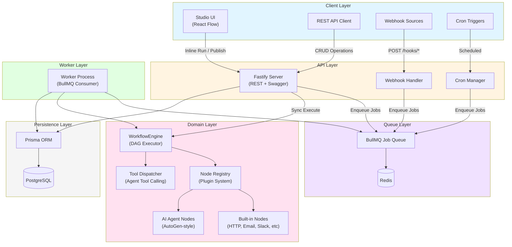

### Architecture Philosophy

The system follows a **layered architecture** with clear separation of concerns:

1. **Presentation Layer**: React-based Studio UI for visual workflow design
2. **API Layer**: Fastify REST server with OpenAPI/Swagger documentation
3. **Queue Layer**: BullMQ with Redis for async job processing
4. **Domain Layer**: Core workflow engine, node registry, and execution logic
5. **Persistence Layer**: PostgreSQL with Prisma ORM for data storage

This design enables:
- **Independent scaling**: API and worker processes can scale separately
- **Technology flexibility**: Each layer can evolve independently
- **Testability**: Domain logic is isolated from infrastructure concerns
- **Deployment flexibility**: Can run embedded (engine only) or full stack

---

## System Design Explanation

### Core Design Principles

| Principle | Implementation | Benefit |
|-----------|----------------|---------|
| **Modularity** | Monorepo with separate packages (core, shared, nodes-base, nodes-agents, ui, server) | Tree-shakable dependencies, install only what you need |
| **Type Safety** | TypeScript + Zod schemas for all configurations | Compile-time and runtime validation, better DX |
| **Plugin Architecture** | Node registry pattern for extensible node definitions | Custom nodes without core modifications |
| **Event-Driven** | BullMQ for async execution, webhooks for external triggers | Decoupled execution, retry handling, scalability |
| **Immutability** | Workflow versions are immutable, new versions create new records | Reproducible executions, audit trail |
| **Separation of Concerns** | Clear boundaries between engine, API, and UI | Independent development, testing, and deployment |

### Tradeoffs and Decisions

**Why Monorepo with Turborepo?**
- **Benefit**: Shared code, unified build pipeline, atomic commits across packages
- **Tradeoff**: Increased initial setup complexity
- **Decision Justification**: The project has multiple interdependent packages that benefit from shared types and coordinated releases

**Why Fastify over Express?**
- **Benefit**: Better performance, built-in schema validation, plugin ecosystem
- **Tradeoff**: Smaller ecosystem compared to Express
- **Decision Justification**: Performance and type safety are critical for a workflow engine

**Why BullMQ over other queue systems?**
- **Benefit**: Redis-backed, excellent TypeScript support, built-in retries, job priorities
- **Tradeoff**: Requires Redis infrastructure
- **Decision Justification**: Best-in-class for Node.js job queues with excellent developer experience

**Why Prisma over raw SQL/TypeORM?**
- **Benefit**: Type-safe queries, excellent migrations, great TypeScript integration
- **Tradeoff**: Runtime overhead, learning curve
- **Decision Justification**: Developer productivity and type safety outweigh minor performance costs

**Why React Flow over custom canvas?**
- **Benefit**: Battle-tested, feature-rich (drag-drop, zoom, pan), active community
- **Tradeoff**: Library dependency, customization limits
- **Decision Justification**: Accelerates development, provides professional UX out-of-the-box

---

## Frontend Architecture

### Technology Stack

- **Framework**: React 18 with TypeScript
- **Build Tool**: Vite 6 (fast HMR, optimized builds)
- **UI Library**: React Flow 11 (workflow canvas), Radix UI (primitives)
- **Styling**: Tailwind CSS v4 (utility-first, modern CSS)
- **Icons**: Lucide React
- **Forms**: React Hook Form + Zod resolvers
- **Notifications**: Sonner (toast notifications)
- **State Management**: React hooks (useState, useContext, useReducer)

### Component Architecture

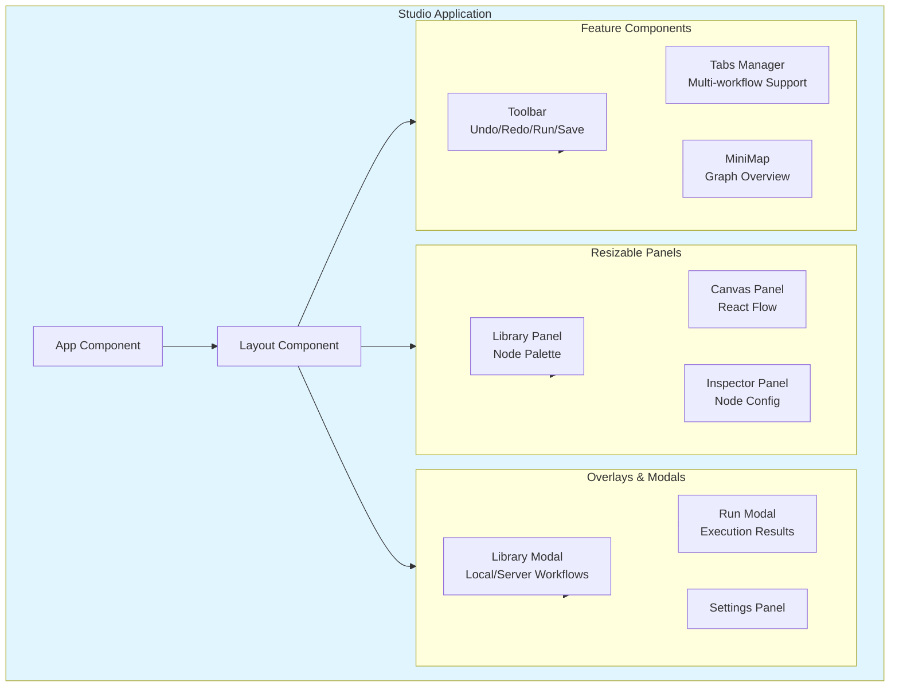

### State Management Strategy

**Local Component State**: Used for UI-specific state (modals, panels, selections)

**Context API**: Used for global application state:
- `WorkflowContext`: Active workflow graph, node selections, undo/redo stack
- `StudioPersistenceContext`: LocalStorage drafts, server workflows
- `APIContext`: API client configuration, authentication

**Why Not Redux/Zustand?**
- The application state is primarily workflow graph data, which is already managed by React Flow
- UI state is simple and localized
- Context API provides sufficient abstraction without additional complexity

### Key Frontend Patterns

1. **Drag-and-Drop**: React Flow's built-in drag-drop for node placement
2. **Undo/Redo**: Custom history stack with React Flow state snapshots
3. **Persistence**: Dual persistence - localStorage for drafts, API for published workflows
4. **Validation**: Real-time Zod schema validation in inspector panel
5. **Export/Import**: JSON serialization/deserialization with schema validation

---

## Backend Architecture

### Technology Stack

- **Runtime**: Node.js 18+
- **Framework**: Fastify 5 (high-performance HTTP server)
- **Language**: TypeScript 5.7
- **ORM**: Prisma 6 (type-safe database access)
- **Queue**: BullMQ 5 (Redis-backed job queue)
- **Validation**: Zod 3 (runtime schema validation)
- **Documentation**: Fastify Swagger + Swagger UI

### Service Architecture

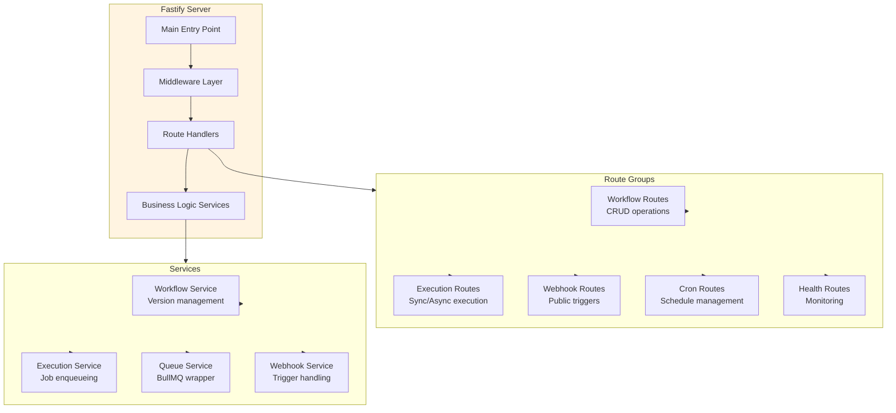

### API Design Principles

**RESTful Conventions**: Standard HTTP verbs and status codes
- `GET /workflows` - List workflows
- `POST /workflows` - Create workflow
- `POST /workflows/:id/versions` - Create version
- `POST /executions` - Execute workflow
- `GET /executions/:id` - Get execution result

**OpenAPI/Swagger**: Auto-generated documentation at `/api-docs`

**Error Handling**: Consistent error response format
```json
{
  "error": {
    "message": "Validation failed",
    "code": "VALIDATION_ERROR",
    "details": [...]
  }
}
```

**Authentication**: API key via `x-api-key` header (optional, bypassed for webhooks)

### Worker Architecture

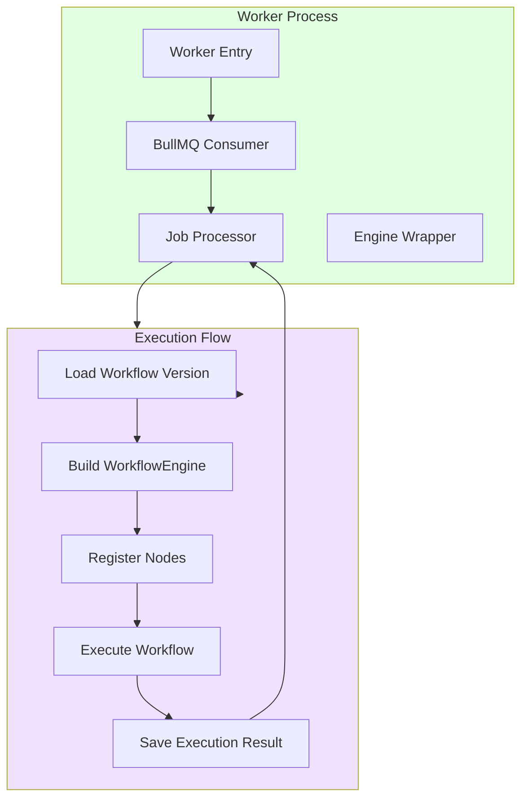

**Worker Responsibilities**:
- Poll Redis for jobs via BullMQ
- Load workflow version from PostgreSQL
- Initialize WorkflowEngine with appropriate node registry
- Execute workflow with initial data
- Persist execution results to PostgreSQL
- Handle retries and errors per job configuration

**Scaling Strategy**:
- Horizontal scaling: Run multiple worker processes
- Job priorities: Critical workflows get priority
- Concurrency limits: Per-node concurrency controls
- Dead letter queue: Failed jobs for manual inspection

---

## Database Design

### Schema Overview

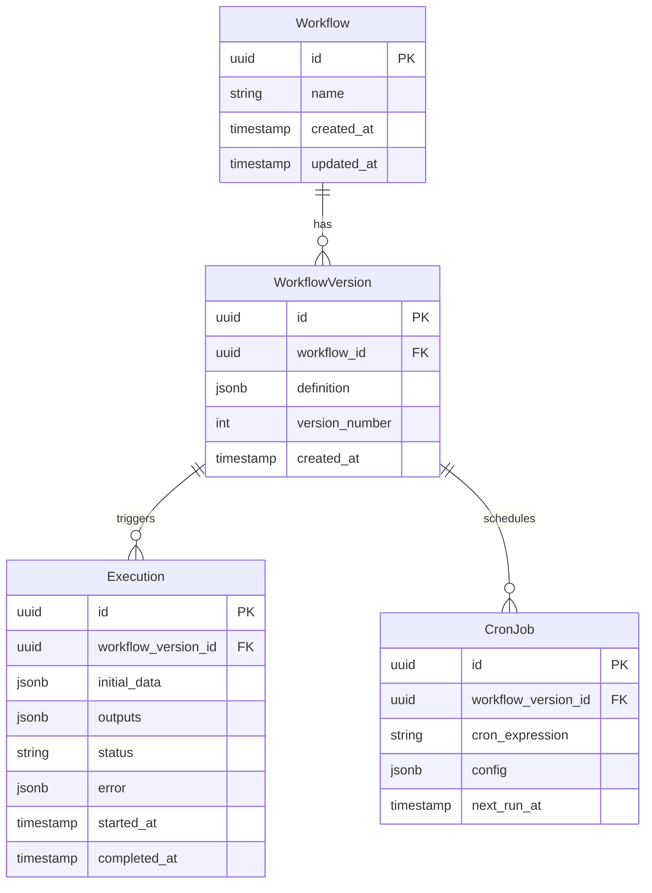

### Key Design Decisions

**JSONB for Workflow Definitions**:
- **Benefit**: Flexible schema, efficient storage, queryable
- **Tradeoff**: No foreign key constraints on node references
- **Justification**: Workflow structure is inherently flexible, JSONB provides the right balance

**Immutable Versions**:
- **Benefit**: Reproducible executions, audit trail, rollback capability
- **Tradeoff**: Storage growth over time
- **Justification**: Critical for debugging and compliance in production workflows

**Execution Status Tracking**:
- **Statuses**: `pending`, `running`, `completed`, `failed`, `cancelled`
- **Benefit**: Clear state machine for monitoring and retries
- **Justification**: Essential for async execution and job queue management

### Indexing Strategy

```sql
-- Workflow lookups
CREATE INDEX idx_workflow_name ON workflows(name);
CREATE INDEX idx_workflow_created ON workflows(created_at DESC);

-- Version queries
CREATE INDEX idx_version_workflow ON workflow_versions(workflow_id);
CREATE INDEX idx_version_number ON workflow_versions(workflow_id, version_number DESC);

-- Execution monitoring
CREATE INDEX idx_execution_version ON executions(workflow_version_id);
CREATE INDEX idx_execution_status ON executions(status);
CREATE INDEX idx_execution_started ON executions(started_at DESC);

-- Cron job scheduling
CREATE INDEX idx_cron_next_run ON cron_jobs(next_run_at);
```

---

## Authentication & Authorization Flow

### Current Implementation

**API Key Authentication** (Simple, Production-Ready for Internal Use):

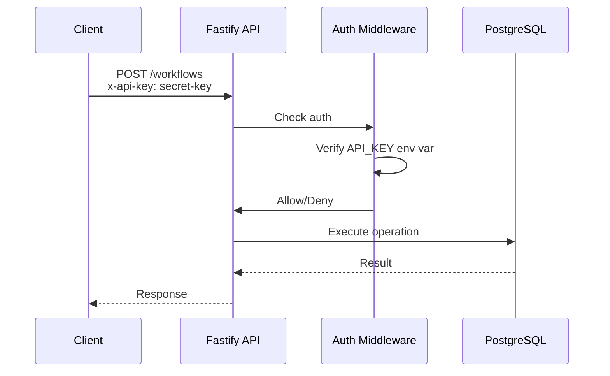

**Webhook Bypass**:
- Webhook endpoints (`/hooks/*`) bypass API key authentication
- **Security Consideration**: Protect via network rules, reverse proxy auth, or custom middleware

### Authorization Model

**Current**: All-or-nothing based on API key presence
**Future Roadmap**:
- Role-based access control (RBAC)
- Workflow-level permissions
- Team/organization support
- OAuth 2.0 / OpenID Connect integration

### Security Best Practices

1. **API Key Storage**: Environment variables, never in code
2. **Key Rotation**: Support for key rotation without downtime
3. **Rate Limiting**: Per-key rate limits (planned)
4. **Audit Logging**: Log all authenticated actions (planned)
5. **HTTPS Only**: Enforce TLS in production

---

## API Architecture

### API Layer Structure

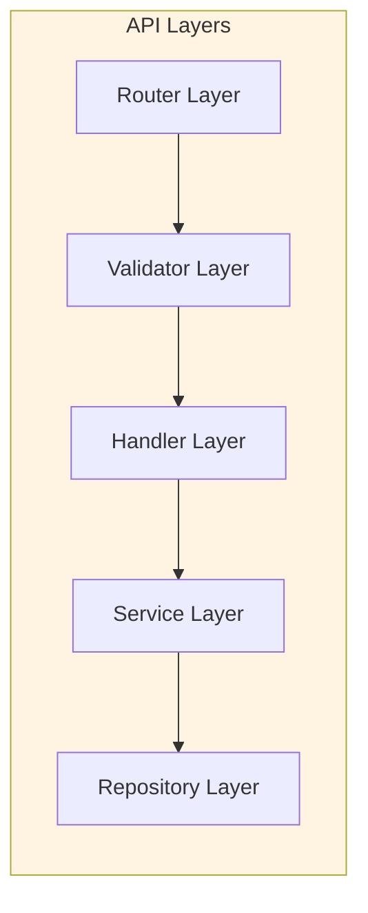

### Request Lifecycle

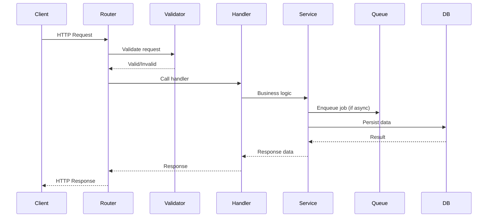

### API Endpoints Summary

| Category | Endpoints | Purpose |
|----------|-----------|---------|
| **Workflows** | GET/POST `/workflows` | CRUD workflow containers |
| **Versions** | POST `/workflows/:id/versions` | Create immutable versions |
| **Executions** | POST `/executions`, GET `/executions/:id` | Run and query executions |
| **Webhooks** | POST `/hooks/by-version/:versionId` | Trigger workflows via webhooks |
| **Cron** | POST/DELETE `/workflow-versions/:versionId/cron` | Schedule recurring executions |
| **Health** | GET `/health` | Health check for monitoring |

### Async vs Sync Execution

**Sync Execution** (`POST /executions` with `async: false`):
- Blocks until workflow completes
- Returns full execution result
- Use for fast workflows (< 30s)

**Async Execution** (`POST /executions` with `async: true`):
- Returns immediately with execution ID
- Worker processes job in background
- Poll `/executions/:id` for results
- Use for long-running workflows

---

## State Management Strategy

### Workflow State

**Definition State**: Immutable workflow versions stored in PostgreSQL
- Never modified after creation
- Enables reproducible executions
- Provides audit trail

**Execution State**: Mutable execution records
- Status transitions: `pending` → `running` → `completed`/`failed`
- Outputs stored as JSONB
- Error information for debugging

**Runtime State**: In-memory during execution
- WorkflowEngine maintains execution context
- Node outputs passed via edges
- Temporary, not persisted

### Frontend State

**Studio Application State**:
```typescript
interface StudioState {
  activeTab: string;
  tabs: Tab[];
  workflow: WorkflowDefinition;
  selectedNodes: string[];
  undoStack: WorkflowDefinition[];
  redoStack: WorkflowDefinition[];
  library: LocalDraft[] | ServerWorkflow[];
}
```

**Persistence Strategy**:
- **LocalStorage**: Quick drafts, browser-specific
- **Server API**: Published workflows, shareable across users
- **Session Storage**: Temporary UI state

### Worker State

**Job State**: Managed by BullMQ
- Job statuses: `waiting`, `active`, `completed`, `failed`
- Retry counts and backoff strategies
- Job metadata for monitoring

**Engine State**: Per-execution
- WorkflowEngine instance per job
- Node registry shared across jobs
- No cross-job state isolation

---

## Folder Structure Explanation

```bash
workflow-engine-sdk/
├── apps/                          # Runnable applications
│   ├── server/                    # Fastify REST API + Worker
│   │   ├── prisma/               # Database schema and migrations
│   │   ├── src/
│   │   │   ├── routes/          # API route handlers
│   │   │   ├── services/        # Business logic services
│   │   │   ├── worker.ts        # BullMQ worker entry
│   │   │   └── main.ts          # Fastify server entry
│   │   ├── package.json
│   │   └── tsconfig.json
│   │
│   └── studio/                   # React Flow visual editor
│       ├── public/               # Static assets
│       ├── scripts/              # Build/deployment scripts
│       ├── src/
│       │   ├── components/      # React components
│       │   ├── lib/             # Utilities and helpers
│       │   ├── palette-data.ts  # Node palette configuration
│       │   └── main.tsx         # React entry point
│       ├── index.html
│       ├── package.json
│       └── tsconfig.json
│
├── packages/                      # Shared libraries
│   ├── shared/                   # Shared types and schemas
│   │   ├── src/
│   │   │   ├── workflow.schema.ts    # Zod workflow validation
│   │   │   ├── workflow-dag.ts       # DAG utilities
│   │   │   └── index.ts
│   │   ├── package.json
│   │   └── tsconfig.json
│   │
│   ├── core/                     # Core workflow engine
│   │   ├── src/
│   │   │   ├── engine.ts              # Main WorkflowEngine class
│   │   │   ├── registry.ts            # Node registry
│   │   │   ├── dag.ts                 # Topological sort
│   │   │   ├── agent-tool-dispatch.ts # Agent tool calling
│   │   │   ├── executor.ts            # Execution orchestration
│   │   │   ├── errors.ts              # Error types
│   │   │   └── index.ts
│   │   ├── package.json
│   │   └── tsconfig.json
│   │
│   ├── nodes-base/               # Built-in node implementations
│   │   ├── src/
│   │   │   ├── triggers/       # Trigger nodes (webhook, cron)
│   │   │   ├── http.request.ts # HTTP request node
│   │   │   ├── email.send.ts   # Email sending
│   │   │   ├── email.read.ts   # Email reading (IMAP)
│   │   │   ├── slack.send.ts   # Slack integration
│   │   │   ├── postgres.query.ts # Database queries
│   │   │   ├── file.read.ts    # File operations
│   │   │   ├── file.write.ts
│   │   │   ├── noop.ts         # No-op node
│   │   │   └── index.ts
│   │   ├── package.json
│   │   └── tsconfig.json
│   │
│   ├── nodes-agents/            # AI agent nodes
│   │   ├── src/
│   │   │   ├── runtime/
│   │   │   │   ├── autogen-orchestrator.ts  # Multi-agent orchestration
│   │   │   │   ├── openai-tool-loop.ts      # OpenAI tool calling
│   │   │   │   └── agent-tool-dispatch.ts   # Tool dispatch logic
│   │   │   ├── schemas.ts                 # Agent config schemas
│   │   │   ├── agent-tools.schema.ts       # Tool reference schemas
│   │   │   └── index.ts
│   │   ├── package.json
│   │   └── tsconfig.json
│   │
│   └── ui/                       # Shared UI components
│       ├── src/
│       │   ├── canvas/         # React Flow wrapper
│       │   ├── nodes/          # Custom node components
│       │   └── index.ts
│       ├── package.json
│       └── tsconfig.json
│
├── examples/                     # Example workflows and code
│   ├── programmatic/            # Engine-only usage examples
│   │   ├── src/
│   │   ├── package.json
│   │   └── tsconfig.json
│   │
│   ├── workflows/               # Importable workflow JSON
│   │   ├── agent-with-tools-skeleton.json
│   │   ├── email-notify-slack-import.json
│   │   ├── generate-unit-tests-from-github.json
│   │   └── ...
│   │
│   ├── studio/                  # Studio-specific examples
│   └── python-autogen-bridge/  # Python integration examples
│
├── docs/                        # Documentation
│   ├── ARCHITECTURE.md          # Architecture overview
│   ├── AI-AGENTS-ARCHITECTURE.md # AI agent design
│   ├── DEPLOYMENT.md            # Deployment guide
│   ├── FILE-STRUCTURE.md        # File structure details
│   └── README.md                # Extended documentation
│
├── infra/                       # Infrastructure
│   └── docker-compose.yml       # Local development stack
│
├── .env.example                 # Environment variables template
├── .gitignore
├── package.json                 # Root package.json (workspaces)
├── turbo.json                   # Turborepo configuration
├── tsconfig.base.json           # Base TypeScript config
└── README.md                    # Project README
```

### Package Dependencies

```
@wfengine/shared (types, schemas)
    ↑
    ├─→ @wfengine/core (engine, registry)
    │       ↑
    │       ├─→ @wfengine/nodes-base (built-in nodes)
    │       └─→ @wfengine/nodes-agents (AI agent nodes)
    │
    ├─→ @wfengine/ui (React components)
    │       ↑
    │       └─→ examples-studio (Studio app)
    │
    └─→ @wfengine/server (API + Worker)
            ├─→ @wfengine/core
            ├─→ @wfengine/nodes-base
            └─→ @wfengine/nodes-agents
```

---

## DevOps & Deployment Architecture

### Local Development

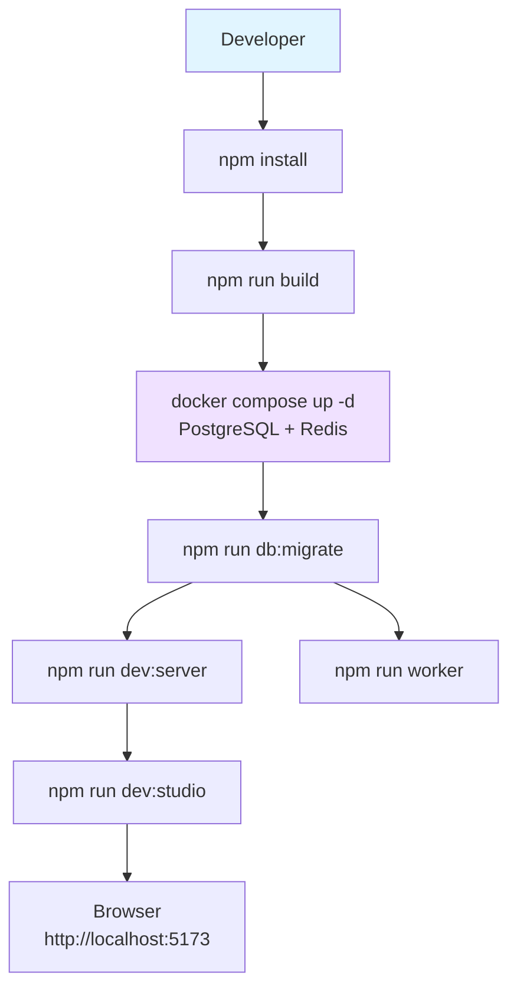

### Production Deployment

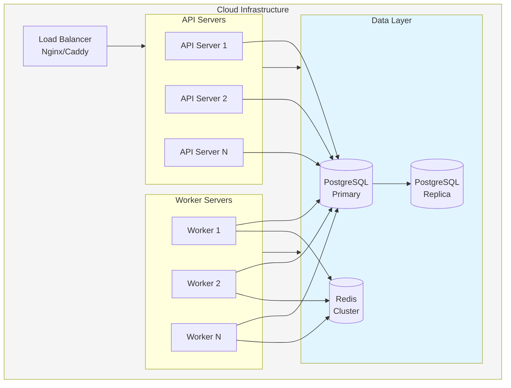

### Deployment Platforms

**Railway** (Primary deployment target):
- Managed PostgreSQL, Redis
- Automatic deployments from Git
- Built-in monitoring and logs
- Zero-config scaling

**Docker Compose** (Self-hosted):
- Full control over infrastructure
- Suitable for on-premise deployments
- Requires manual operations

**Kubernetes** (Enterprise):
- Scalable and resilient
- Complex setup and maintenance
- Suitable for large-scale deployments

### CI/CD Pipeline

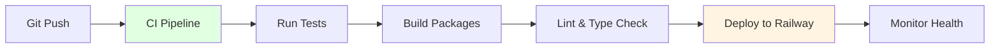

**CI Steps**:
1. Run tests: `npm test`
2. Build packages: `npm run build`
3. Type check: `tsc --noEmit`
4. Deploy to Railway (automatic on main branch)

---

## Security Best Practices

### Current Security Measures

1. **Input Validation**: All inputs validated via Zod schemas
2. **SQL Injection Prevention**: Prisma ORM prevents SQL injection
3. **URL Filtering**: HTTP nodes block non-http(s) URLs
4. **No Code Execution**: Core engine has no `eval()` or similar
5. **API Key Authentication**: Optional API key for API access
6. **Environment Variables**: Secrets stored in environment, not code

### Security Considerations

**Webhook Security**:
- Webhook endpoints bypass API key authentication
- **Recommendation**: Protect via network rules, reverse proxy, or custom auth
- **Future**: HMAC signature verification

**Node Execution Security**:
- Built-in nodes have controlled capabilities
- Custom nodes run in same process (no sandbox)
- **Future**: Isolated execution environment (containers, VMs)

**AI Agent Security**:
- Tool calling enables agents to execute nodes
- **Risk**: Agent could trigger unintended actions
- **Mitigation**: Tool-only nodes require explicit agent invocation
- **Future**: Permission system, approval workflows

### Recommended Hardening

1. **HTTPS Only**: Enforce TLS in production
2. **Rate Limiting**: Implement per-IP and per-key rate limits
3. **Input Sanitization**: Additional sanitization for user-provided content
4. **Secrets Management**: Use secret manager (AWS Secrets Manager, etc.)
5. **Audit Logging**: Log all workflow executions and API calls
6. **Network Isolation**: Restrict database and Redis access
7. **Regular Updates**: Keep dependencies updated for security patches

---

## Scalability Strategy

### Horizontal Scaling

**API Servers**:
- Stateless design enables horizontal scaling
- Load balancer distributes requests
- Shared PostgreSQL and Redis

**Worker Processes**:
- Multiple workers consume from same Redis queue
- BullMQ handles job distribution
- Scale based on queue length and execution time

### Vertical Scaling

**Database**:
- Read replicas for query scaling
- Connection pooling (Prisma built-in)
- Index optimization for common queries

**Redis**:
- Redis Cluster for high availability
- Memory optimization for job data
- Persistence configuration for durability

### Performance Optimization

**Workflow Execution**:
- Topological sort for efficient node ordering
- Parallel execution where possible (future)
- Node-level caching for expensive operations

**Database**:
- Connection pooling
- Query optimization
- JSONB indexing for workflow queries

**Queue**:
- Job priorities for critical workflows
- Concurrency limits per workflow type
- Dead letter queue for failed jobs

### Scaling Triggers

**Auto-scaling Considerations**:
- Queue length > threshold: Add workers
- CPU utilization > threshold: Add API servers
- Database connections > threshold: Add read replicas

---

## Performance Optimizations

### Engine Optimizations

1. **Topological Sort**: O(V + E) complexity for DAG traversal
2. **Node Registry**: O(1) node lookup by type
3. **Input Merging**: Shallow merge for performance
4. **Lazy Loading**: Load node implementations on demand

### API Optimizations

1. **Fastify**: High-performance HTTP server
2. **Connection Pooling**: Reuse database connections
3. **Response Compression**: Gzip compression enabled
4. **Swagger Caching**: Cached OpenAPI spec

### Database Optimizations

1. **JSONB Storage**: Efficient for workflow definitions
2. **Indexing**: Strategic indexes on common queries
3. **Connection Pooling**: Prisma connection pool
4. **Query Optimization**: Efficient Prisma queries

### Frontend Optimizations

1. **Vite**: Fast HMR and optimized builds
2. **Code Splitting**: Lazy load components
3. **React Flow**: Efficient canvas rendering
4. **LocalStorage**: Fast local draft persistence

### Monitoring Performance

**Key Metrics**:
- Workflow execution time (p50, p95, p99)
- API response times
- Queue length and processing time
- Database query performance
- Worker CPU and memory utilization

---

## Logging & Monitoring

### Logging Strategy

**Structured Logging**: JSON-formatted logs for machine parsing
```json
{
  "timestamp": "2024-01-01T00:00:00Z",
  "level": "info",
  "service": "worker",
  "workflowId": "uuid",
  "executionId": "uuid",
  "message": "Workflow execution completed",
  "duration": 1234
}
```

**Log Levels**:
- `error`: Critical failures requiring attention
- `warn`: Warning conditions that don't stop execution
- `info`: Normal operational messages
- `debug`: Detailed debugging information

**Log Destinations**:
- Console output (development)
- File output (production)
- Log aggregation service (future: Datadog, Loki)

### Monitoring Strategy

**Health Checks**:
- `GET /health`: API health check
- Database connectivity check
- Redis connectivity check
- Worker process monitoring

**Metrics to Track**:
- Workflow execution success rate
- Average execution time
- Queue depth and processing rate
- API request rate and error rate
- Database connection pool usage

**Recommended Tools**:
- **Prometheus + Grafana**: Metrics collection and visualization
- **Datadog**: All-in-one monitoring (SaaS)
- **Sentry**: Error tracking and alerting

---

## Error Handling Strategy

### Error Types

```typescript
// Core engine errors
class WorkflowExecutionError extends Error {
  constructor(
    public workflowId: string,
    public nodeId: string,
    message: string
  ) {
    super(message);
  }
}

class NodeExecutionError extends Error {
  constructor(
    public nodeType: string,
    public nodeId: string,
    message: string
  ) {
    super(message);
  }
}

class ValidationError extends Error {
  constructor(
    public schemaErrors: ZodError,
    message: string
  ) {
    super(message);
  }
}
```

### Error Handling Flow

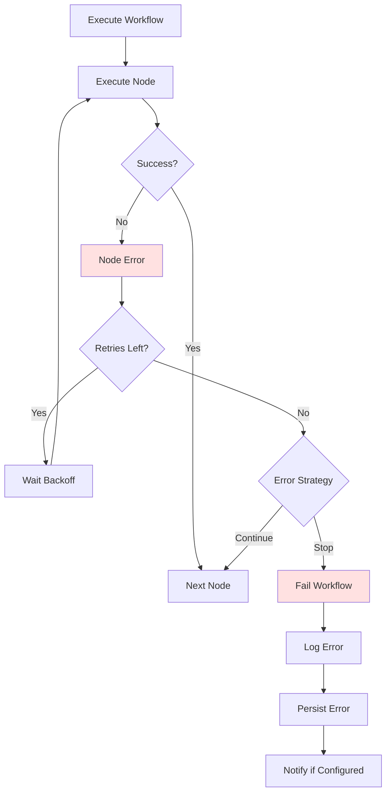

### Retry Strategy

**Configurable Retry Policy**:
```typescript
interface RetryPolicy {
  maxRetries: number;
  backoffStrategy: 'exponential' | 'linear' | 'fixed';
  initialDelay: number;
  maxDelay: number;
}
```

**Error Handling Modes**:
- `stop`: Stop workflow on first error (default)
- `continue`: Continue to next nodes despite error

### Error Recovery

**Dead Letter Queue**: Failed jobs moved to DLQ for inspection
**Manual Retry**: Failed executions can be retried via API
**Error Notifications**: Optional webhook notifications on failures

---

## CI/CD Pipeline

### Pipeline Stages

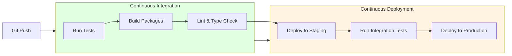

### CI Configuration

**GitHub Actions** (example):
```yaml
name: CI/CD

on:
  push:
    branches: [main]
  pull_request:
    branches: [main]

jobs:
  test:
    runs-on: ubuntu-latest
    steps:
      - uses: actions/checkout@v3
      - uses: actions/setup-node@v3
        with:
          node-version: '18'
      - run: npm install
      - run: npm test
      - run: npm run build

  deploy:
    needs: test
    if: github.ref == 'refs/heads/main'
    runs-on: ubuntu-latest
    steps:
      - uses: actions/checkout@v3
      - uses: railwayapp/cli@v1
        with:
          railway-token: ${{ secrets.RAILWAY_TOKEN }}
          command: up
```

### Deployment Strategy

**Railway Automatic Deployment**:
- Automatic deployment on push to main
- Zero-downtime deployments
- Rollback capability

**Manual Deployment**:
- `npm run build:railway` for optimized builds
- Railway CLI for manual control
- Environment variable management via Railway dashboard

---

## Design Patterns Used

### Core Patterns

**Registry Pattern**:
- Node registry for extensible node types
- Dynamic node registration at runtime
- Enables plugin architecture

**Strategy Pattern**:
- Different execution strategies (sync vs async)
- Configurable retry strategies
- Pluggable error handling

**Builder Pattern**:
- Workflow definition construction
- Fluent API for complex workflows
- Type-safe workflow building

**Observer Pattern**:
- Execution progress tracking
- Event emission for node completion
- Real-time status updates

### Architecture Patterns

**Layered Architecture**:
- Clear separation between presentation, API, domain, and persistence
- Each layer has well-defined responsibilities
- Enables independent testing and evolution

**Plugin Architecture**:
- Core engine is minimal and extensible
- Nodes are plugins registered at runtime
- Enables custom functionality without core changes

**Event-Driven Architecture**:
- BullMQ for async job processing
- Webhooks for external triggers
- Decoupled execution from API

**Repository Pattern**:
- Data access abstraction via Prisma
- Service layer uses repository interfaces
- Enables easy data source changes

---

## Data Flow Explanation

### Workflow Execution Flow

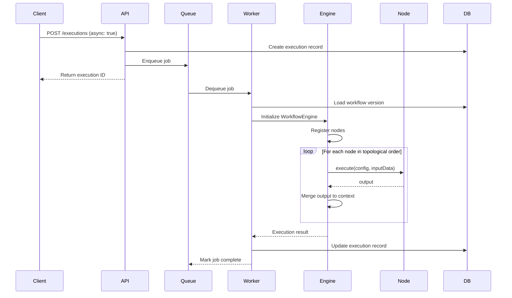

### Data Transformation Flow

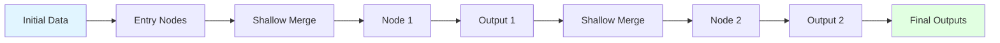

**Data Flow Rules**:
1. Entry nodes receive `initialData` as input
2. Each node receives shallow merge of upstream object outputs
3. Non-object outputs are keyed by parent node ID
4. Final outputs contain all node outputs merged together

### AI Agent Tool Calling Flow

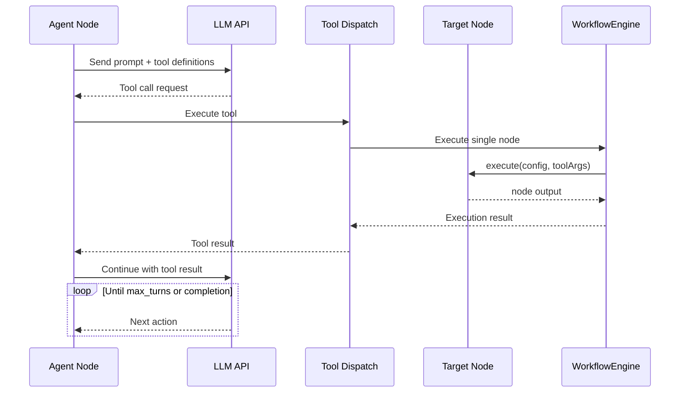

---

## Future Improvements

### Short-Term Roadmap (3-6 months)

**Enhanced Security**:
- HMAC signature verification for webhooks
- Per-workflow API keys
- Rate limiting implementation
- Audit logging for all operations

**Performance**:
- Parallel node execution where DAG allows
- Node-level result caching
- Database query optimization
- Connection pool tuning

**Developer Experience**:
- Workflow testing framework
- Debug mode with step-through execution
- Workflow version diff viewer
- Export execution traces

### Medium-Term Roadmap (6-12 months)

**AI Enhancements**:
- Full tool loop implementation for agents
- Agent execution sandboxing
- Multi-agent coordination patterns
- Agent library management UI

**Platform Features**:
- Team/organization support
- Role-based access control (RBAC)
- Workflow templates marketplace
- Scheduled workflow dashboard

**Integrations**:
- More built-in nodes (AWS, GCP, Azure)
- OAuth authentication for external services
- Webhook result callbacks
- Custom node marketplace

### Long-Term Vision (12+ months)

**Enterprise Features**:
- Multi-region deployment
- High availability setup
- Advanced monitoring and alerting
- Compliance reporting (SOC2, HIPAA)

**Ecosystem**:
- Public node registry
- Community-contributed nodes
- Workflow sharing platform
- Integration with popular SaaS tools

**Technical Excellence**:
- GraphQL API alternative
- WebSocket for real-time updates
- Workflow simulation and validation
- Performance profiling tools

---

## Conclusion

**wfengine** represents a modern, developer-first approach to workflow automation, balancing simplicity with extensibility. The architecture prioritizes:

- **Modularity**: Install only what you need, from core engine to full stack
- **Type Safety**: TypeScript and Zod provide compile-time and runtime validation
- **Extensibility**: Plugin architecture enables custom nodes without core changes
- **Production-Ready**: BullMQ, PostgreSQL, and Docker enable scalable deployments
- **AI-Native**: Built-in support for multi-agent workflows with tool calling

The layered architecture with clear separation of concerns enables independent evolution of each component, while the monorepo structure ensures coordinated development across packages. The system is designed to scale from embedded usage in small applications to enterprise-grade workflow orchestration.

The architecture supports multiple deployment models (embedded, hosted, cloud-native) and execution modes (sync, async, scheduled), making it suitable for a wide range of use cases from simple automation to complex AI agent workflows.

Future development will focus on enhanced security, improved performance, richer AI capabilities, and enterprise features, all while maintaining the core philosophy of developer experience and flexibility.
