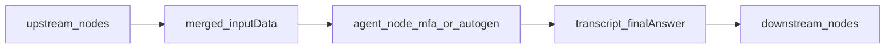

# wfengine vs Microsoft AutoGen Studio — relationship & node inventory

This document compares **this repository’s wfengine Studio** (visual DAG workflows executed by `@wfengine/core` on Node.js) with **Microsoft AutoGen Studio** (`autogenstudio`, Python UI on top of **AutoGen AgentChat**). It also lists **built-in node types** registered in the main server path.

---

## How related are the two systems?

| Dimension | **wfengine (this repo)** | **AutoGen Studio (Microsoft)** |
|-----------|-------------------------|--------------------------------|
| **Runtime** | Node.js + TypeScript; `WorkflowEngine` runs a **DAG** of registered `NodeDefinition`s | Python; **AgentChat** teams, FastAPI backend, Gatsby/Tailwind UI |
| **Graph model** | **General workflow**: HTTP, DB, files, GitHub, Slack, *and* LLM/agent steps — arbitrary mixing | **Agent-centric**: teams, agents, tools, models, termination — optimized for **multi-agent chat** |
| **“Nodes”** | Flat **`type`** strings (`http.request`, `slack.send`, …) + edges | **Components** (agents, teams, model clients, tools) — not the same vocabulary |
| **LLM / agents** | Optional packages: `@wfengine/nodes-base` (e.g. `llm.generate-unit-tests`), `@wfengine/nodes-agents` (`mfa.agent-group`, `autogen.*`) | First-class **AssistantAgent**, **UserProxy**, group chats, round-robin / selectors |
| **Purpose** | Integrations + automation pipelines (CI-style repos, notifications, data) with AI steps where needed | Rapid **prototype** of multi-agent apps (not marketed as production-ready) |
| **Overlap** | Conceptually similar **multi-agent orchestration** (your `mfa` / `autogen` nodes) vs AutoGen’s **teams** — both coordinate LLM roles; **different implementations and ecosystems** | Same conceptual overlap; **not wire-compatible** without bridges |

**Bottom line:** wfengine is **related in intent** (workflows + AI agents) but **not the same product**. It is closer to a **general integration/workflow engine with optional AI nodes** than to AutoGen Studio’s **specialized agent-team UI**.

---

## Node types registered in wfengine “main” stack

The API/worker engine is built in `apps/server/src/engine-factory.ts`:

1. **`registerBuiltinNodes`** → `@wfengine/nodes-base`
2. **`registerAgentNodes`** → `@wfengine/nodes-agents`

Below are **`type` IDs** (what appears in workflow JSON and registry).

### `@wfengine/nodes-base`

| Node `type` | Role (short) |
|-------------|----------------|
| `noop` | Pass-through |
| `http.request` | HTTP client |
| `trigger.webhook` | Webhook entry |
| `trigger.cron` | Cron entry |
| `email.send` | SMTP send |
| `email.read` | IMAP read |
| `slack.send` | Slack message |
| `postgres.query` | PostgreSQL |
| `file.read` / `file.write` | Local files |
| `github.repo.list-branches` | List branches/tags |
| `github.repo.analyze` | Repo analysis |
| `github.files.read` | Fetch repo files |
| `github.repo.generate-tests-llm` | LLM tests inside GitHub flow |
| `llm.generate-unit-tests` | OpenAI-compatible unit-test generation |
| `code.write-test-files` | Write generated tests to disk |
| `github.repo.run-tests` | Clone/local run tests |

### `@wfengine/nodes-agents`

| Node `type` | Role (short) |
|-------------|----------------|
| `mfa.agent-group` | Multi-agent group over merged JSON (OpenAI-compatible orchestration) |
| `autogen.agent` | Single agent step (chat or Python bridge) |
| `autogen.multi-agent` | Multi-agent round-robin or Python AutoGen bridge |

---

## Studio palette labels (`apps/studio/src/palette-data.ts`)

The sidebar groups **human-readable** entries (each maps to a `type` above):

| Category | Palette labels |
|----------|----------------|
| **Triggers** | Webhook, Cron |
| **Actions** | HTTP Request, Pass-through, Send Email, Read Email (IMAP), Send Slack |
| **Data** | Postgres Query, Read File, Write File |
| **GitHub** | GitHub: List branches, GitHub: Analyze repo |
| **Testing** | GitHub: Read files, LLM: Generate unit tests, Code: Write test files, GitHub: Generate tests (LLM), GitHub: Run tests |
| **AI Agents** (palette) | MAF: Agent group, AutoGen: Single agent, AutoGen: Multi-agent |

Anything defined in JSON but **not** in the palette can still run if the server registers that `type`.

---

## What AutoGen Studio provides (conceptual inventory)

AutoGen Studio’s **Team Builder** is documented around **AgentChat components**, not wfengine-style DAG nodes:

| Area | What users configure (typical) |
|------|--------------------------------|
| **Teams** | Group chats, selectors, round-robin patterns |
| **Agents** | e.g. **AssistantAgent**, human-facing **UserProxy** interaction in Playground |
| **Tools** | Bound tools / capabilities for agents |
| **Models** | Model clients (OpenAI API shape): OpenAI, Azure OpenAI, Anthropic, local OpenAI-compatible servers |
| **Termination** | Conditions to stop a run |

Official overview: [AutoGen Studio user guide](https://microsoft.github.io/autogen/stable/user-guide/autogenstudio-user-guide/index.html).

wfengine **does not** ship Postgres/email/GitHub file-fetch nodes inside AutoGen Studio; AutoGen Studio **does not** ship your DAG executor — they solve adjacent problems.

---

## Feature overlap snapshot

| Capability | wfengine | AutoGen Studio |
|------------|----------|----------------|
| Visual builder | Yes (React Flow Studio) | Yes (Team Builder) |
| Multi-agent LLM orchestration | Yes (`mfa.*`, `autogen.*` nodes) | Yes (native AgentChat teams) |
| Arbitrary integrations (HTTP, Slack, DB, …) | Yes (first-class nodes) | Not the focus; extensions via tools/backend |
| Same codebase as Microsoft AutoGen Python | No | Yes |

---

## Multi-agent: how wfengine maps to AutoGen-style ideas

Both systems coordinate **multiple LLM-backed roles** over a shared task. Terminology differs: AutoGen Studio speaks in **teams** and **AgentChat** components; wfengine uses **DAG nodes** from [`@wfengine/nodes-agents`](../packages/nodes-agents/README.md) with merged **`inputData`**.

| wfengine node | AutoGen Studio / AgentChat (conceptual) |
|---------------|----------------------------------------|
| `mfa.agent-group` (`sequential` / `single_completion`) | Several personas discussing or refining one payload — similar to a **multi-agent team** over a task |
| `autogen.multi-agent` (`orchestrated_openai`) | **Round-robin–style** turns among agents (simplified orchestration in Node, not a full AgentChat runtime) |
| `autogen.agent` | Single **assistant-style** step |
| `autogen.*` with **`python_autogen` runtime** | Delegate execution to **real Python AutoGen/ag2** via a stdin/stdout JSON bridge on the host |
| Agent nodes **downstream of** `http.request`, `github.*`, etc. | Same graph mixes **integrations + agents**; AutoGen Studio is primarily **agent-centric** |

**Non-goals:** wfengine does **not** embed Microsoft’s Python or .NET **Agent Framework** runtimes in-process. The Node path uses **OpenAI-compatible** HTTP APIs for orchestration; use the **Python bridge** when you need authentic AutoGen/ag2 behaviour.

### Data flow (manager-friendly)

### Demo workflow

Import **[examples/workflows/multi-agent-demo-import.json](../examples/workflows/multi-agent-demo-import.json)** in Studio (`noop` → `mfa.agent-group`) for a minimal multi-agent run. Requires **`OPENAI_API_KEY`** or **`WFENGINE_OPENAI_API_KEY`** on the workflow runner (or `openAiApiKey` on the node). See [`packages/nodes-agents/README.md`](../packages/nodes-agents/README.md) for environment variables and the **Python bridge** JSON contract.

---

## References

- wfengine registration: `packages/nodes-base/src/index.ts`, `packages/nodes-agents/src/register.ts`, `apps/server/src/engine-factory.ts`
- Multi-agent package (env, Python bridge): [`packages/nodes-agents/README.md`](../packages/nodes-agents/README.md)
- Demo import: [`examples/workflows/multi-agent-demo-import.json`](../examples/workflows/multi-agent-demo-import.json)
- Studio palette: `apps/studio/src/palette-data.ts`
- AutoGen Studio README / architecture: [microsoft/autogen — autogen-studio](https://github.com/microsoft/autogen/tree/main/python/packages/autogen-studio)
