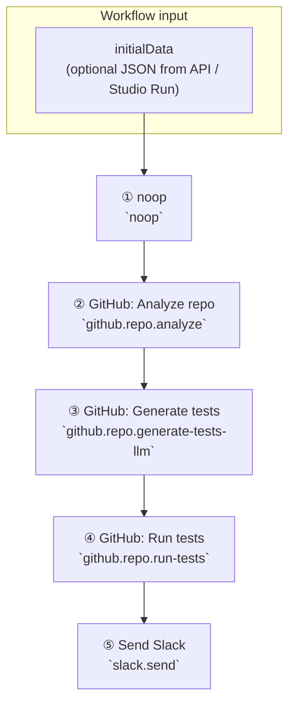

# Block diagram: GitHub analyze → generate tests → run tests → Slack

This document describes the linear workflow shown in Studio for **`fintelconnect/fintel-webcrawler-monorepo`** (or any repo): **noop → analyze → generate-tests-llm → run-tests → Slack**.

The engine builds each node’s **`inputData`** by merging **workflow initial payload** (if any) with **outputs from all upstream nodes** (later parents override keys on conflict). Each row below lists what the node **does** and what it **stores as its output** (what you see in run results / templates).

---

## High-level flow (Mermaid)

---

## Detailed block diagram (data + results)

```mermaid
flowchart LR
  subgraph S1["Step 1 — noop"]
    A1["Merges workflow input\ninto downstream payload"]
    R1["Output: same keys as\nmerged input for this node\n(forwarding pass-through)"]
  end

  subgraph S2["Step 2 — github.repo.analyze"]
    A2["Calls GitHub REST:\nrepo meta, tree, optional\npackage.json; rule-based\nsuggestions"]
    R2["Output: compact repo card,\nfile tree stats, capped\nsourceFiles / testFiles /\nsuggestions, gitOwner/\ngitRepo/gitRef, analysisMeta"]
  end

  subgraph S3["Step 3 — github.repo.generate-tests-llm"]
    A3["Resolves ref → commit;\nranks source paths;\nfetches up to N sources;\nOpenAI-compatible JSON:\ntest files + summary"]
    R3["Output: generatedTestFiles[],\ngeneratedTestSummary[],\nsourceFilesUsed, git* ,\nllmModel, optional warning"]
  end

  subgraph S4["Step 4 — github.repo.run-tests"]
    A4["Temp workspace;\nwrites generated files;\nruns testCommand\n(e.g. npm test / pytest)"]
    R4["Output: success, counts,\nsummary, testResults[],\nfailedTests[], exitCode, …"]
  end

  subgraph S5["Step 5 — slack.send"]
    A5["chat.postMessage\n(redacted templates)"]
    R5["Output: ok, ts, channel\n(no upstream echo)"]
  end

  S1 --> S2 --> S3 --> S4 --> S5
```

---

## Per-node reference

### ① `noop` (Pass-through)

| | |
|--|--|
| **Purpose** | Forward workflow payload unchanged so the next node receives the same object shape (useful when you inject run parameters from Studio/API). |
| **Typical `inputData`** | Merged **initialData** + any parent outputs (here: usually only initial payload if noop is the entry). |
| **Output (stored)** | Shallow copy of **`inputData`** for this node only — **does not** append secrets by itself. |
| **Downstream gets** | **initialData ∪ noopOutput** (same keys as input unless something else merged). |

---

### ② `github.repo.analyze` (GitHub: Analyze repo)

| | |
|--|--|
| **Purpose** | Inspect the repo via GitHub API (tree, blob paths), optional `package.json`, heuristic **suggested test cases** (no LLM). |
| **Config** | `owner`, `repo`, `ref`, optional `githubToken`, `focus`, `includePackageJson`. |
| **Typical `inputData`** | Workflow initial data plus **`gitOwner` / `gitRepo` / `gitRef`** can be overridden by upstream noop if you passed them in initial payload. |
| **Output (stored)** | **`repo`**: compact public metadata (no API href spam, no tokens). **`fileTreeSummary`**: counts + top extensions. **`sourceFiles` / `testFiles`**: **capped lists** with **`sourceFilesTotal`**, **`sourceFilesTruncated`**, **`testFilesTotal`**, **`testFilesTruncated`**. **`suggestedTestCases`**: capped with **`suggestionCount`** and **`suggestedTestCasesTruncated`**. **`analysisMeta`**: runners, stack tags, notes. **`gitOwner`**, **`gitRepo`**, **`gitRef`**. |
| **Downstream gets** | Full merged payload including this output (next node sees **`sourceFiles`**, **`git*`, **`analysisMeta`**, etc.). |

---

### ③ `github.repo.generate-tests-llm` (GitHub: Generate tests)

| | |
|--|--|
| **Purpose** | Fetch ranked subset of source files from GitHub at resolved commit; call LLM with pytest / Jest-Vitest system prompts; return generated test **files** + **summary**. |
| **Config** | `owner`, `repo`, `ref`, tokens, **`maxSourceFiles`** (default **12**, max **25**), **`framework`**, **`llmMaxTokens`**, model, etc. |
| **Typical `inputData`** | **`sourceFiles`** from analyze (used to pick paths), **`gitOwner`**, **`gitRepo`**, **`gitRef`**, **`analysisMeta`** (hints only). |
| **Output (stored)** | **`generatedTestFiles`**: `{ relativePath, content }[]`. **`generatedTestSummary`**: `{ sourceFile, testFile?, description }[]` (from model or fallback). **`sourceFilesUsed`**: paths actually read. **`gitOwner`**, **`gitRepo`**, **`gitRef`**. **`llmModel`**. **`generateWarning`** if partial failure. |
| **Downstream gets** | Merged payload + these fields so **run-tests** can find **`generatedTestFiles`** and **`git*`. |

---

### ④ `github.repo.run-tests` (GitHub: Run tests)

| | |
|--|--|
| **Purpose** | Clone/checkout workspace, materialize **`generatedTestFiles`** into the tree, run **`testCommand`** (default `npm test`; Python repos often set e.g. `pytest` / `python -m pytest`). |
| **Config** | Optional **`owner`**, **`repo`**, **`ref`**, **`githubToken`**, **`testCommand`**, **`workingDirectory`**, **`timeout`**. |
| **Typical `inputData`** | **`gitOwner`**, **`gitRepo`**, **`gitRef`** from upstream; **`generatedTestFiles`** from LLM node. |
| **Output (stored)** | **`success`**, **`repo`**, **`ref`**, **`testCommand`**, **`totalTests`**, **`passed`**, **`failed`**, **`skipped`**, **`duration`**, **`passRate`**, **`summary`**, **`testResults`**, **`failedTests`**, **`rawLogExcerpt`**, **`exitCode`**. |
| **Downstream gets** | Full test report fields for Slack templates. |

---

### ⑤ `slack.send` (Send Slack)

| | |
|--|--|
| **Purpose** | Post **`chat.postMessage`** to a channel; optional templating from merged **`inputData`** (values **redacted** for known secret keys). |
| **Config** | **`token`**, **`channel`**, **`text`**, threading, markdown flags. |
| **Typical `inputData`** | Merged chain: analyze + generate + **run-tests** outputs + initial payload — templates often reference **`success`**, **`summary`**, **`passRate`**, **`suggestionCount`**, etc. |
| **Output (stored)** | **`ok`**, **`ts`**, **`channel`** only — **does not** echo upstream JSON or secrets. |

---

## End-to-end result shape (conceptual)

After a successful run, the **last node’s consumers** (e.g. Slack message text) can reference fields from **run-tests** and earlier nodes still present in **`inputData`** merge. Stored **per-node outputs** stay **focused** (no giant mixed payloads on Slack/generate nodes).

---

## Related types in code

- Analyze output: `GitHubRepoAnalyzeOutputSchema` in `packages/nodes-base/src/config-schemas.ts`
- Generate-tests output: `GitHubRepoGenerateTestsLlmOutputSchema`
- Run-tests output: `GitHubRepoRunTestsOutputSchema`
- Slack output: `SlackSendOutputSchema`
